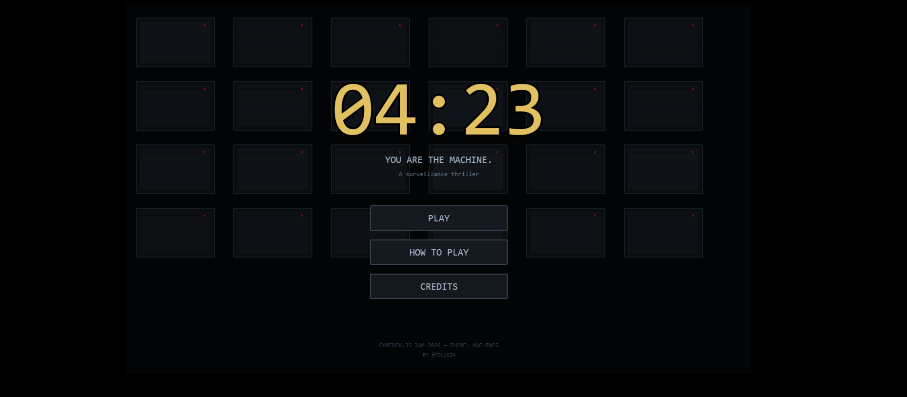

# 04:23


**A surveillance thriller built solo in 24 hours for [Gamedev.js Jam 2026](https://itch.io/jam/gamedevjs-2026).**

> The surveillance system has failed. You are the manual override.

## 🎮 Play

- **Itch.io:** [your-itch-link-here]
- **Wavedash:** [your-wavedash-link-here]

## 🤖 Theme: Machines

You aren't just watching machines. **You ARE the machine.**

Sector 7 runs on autonomous AI — a network of cameras that watch, classify, and respond. Tonight the classifier broke. You've been plugged into the network. The machine processes feeds. You provide the judgment. Modern surveillance is automated AI doing the same pattern matching this game asks of you. When the AI fails, humans take over — manually performing the function the network was built to perform.

## 🎯 How to play

- Click any of the 9 camera feeds to flag a suspicious target
- Watch the **WANTED PROFILES** panel — rules unlock as you progress through 7 levels
- Don't false-flag civilians — every mistake costs you score
- Miss 10 black-outfit intruders → game over
- Press **P** or **ESC** to pause

### Patterns to flag
- ⚫ All-black outfits
- 🔴🟢🔵 R-G-B trios
- 🔴🔴🟢 R-R-G trios
- 🟡 Solo yellow (Level 5+)
- 🔵🔵 Blue-blue pairs (Level 6+)

### Watch for decoys
The hostiles know they're watched. Some wear fake patterns to throw you off.

## 🛠 Built with

- **[Phaser 3](https://phaser.io)** — JavaScript game framework
- **Web Audio API** — Industrial techno music + ambient soundscape generated live in browser
- **Web Speech API** — Synthesized radio chatter
- **Zero audio files** — Every sound generated in-browser

## 🏃 Run locally

It's a single HTML file. Just open `index.html` in a modern browser. Or:

```bash
# With any local server, e.g.:
npx serve .
```

## 📋 Jam Info

- **Jam:** [Gamedev.js Jam 2026](https://itch.io/jam/gamedevjs-2026)
- **Theme:** Machines
- **Time:** Built in 24 hours
- **Challenges entered:**
  - Open Source Challenge (this repo)
  - Build it with Phaser Challenge
  - Deploy to Wavedash Challenge

## 👤 Credits

Designed and built solo by **[@toluszn](https://x.com/toluszn)**.

## 📄 License

MIT — feel free to learn from, modify, or remix.
